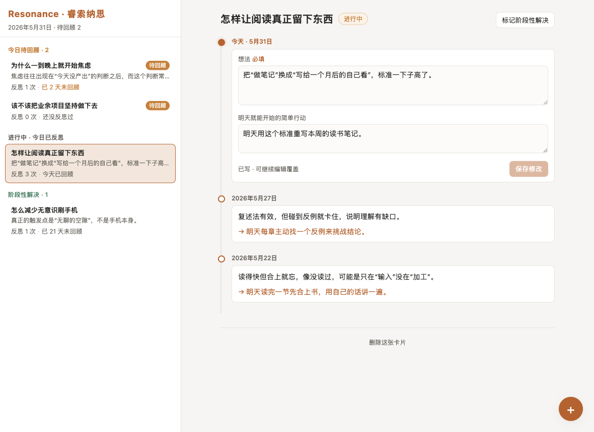

<div align="center">

# Resonance · 睿索纳思

**把同一个问题在时间线上的每一次反思，汇聚成一段回响。**

一个面向个人日常自我提问与反思的轻量卡片工具 · 本地优先 · 零后端

</div>

<p align="center">
  
</p>

---

## 这是什么

我们每天都会冒出一些**尚未解决的问题**——「怎样让阅读真正留下东西」「为什么一到晚上就开始焦虑」。它们值得被持续追问，而不是想一次就忘掉。

Resonance 把每个这样的问题做成一张**卡片**，卡片里沉淀你对它**跨越多天的反思**。当你回看一张卡，会看到同一个问题在时间线上一次次被打磨的轨迹——这就是 *resonance*（回响）。

它刻意保持轻量，承载 [`Reflect.md`](./Reflect.md) 里的一个核心理念：

> **每条反思 = 一段想法 + 一个「明天就能开始」的简单行动。**
> 反思不是空想；它要落到一个明天可执行、且能持续下去的小动作上。

## 核心概念

| 概念 | 含义 |
|---|---|
| **卡片（Card）** | 一个对你尚未解决的问题 |
| **反思条目（Reflection）** | 某一天对该问题的一次回顾 = 想法（必填）+ 明天的简单行动（选填） |
| **每日回顾** | 每天对还没「阶段性解决」的卡片回顾一次；每卡每天至多一条 |
| **时间线** | 一张卡内的历次反思按时间汇聚，可整条通读 |

## 特性

- 🗂️ **问题即卡片**，按「今日待回顾 / 今日已反思 / 阶段性解决」自动分组
- 🧵 **跨时间线**：今天的反思与历史条目融合在同一条时间线里
- ✏️ **当天可改、历史只读**：当日条目可反复编辑（防手误），过了今天即锁定，且任何反思永不可删
- 🎯 **简单行动**：每条反思都鼓励落到一个明天可执行的小动作
- 📱 **手机友好**：宽屏两栏，窄屏自动切换为栈式 master-detail
- 💾 **本地优先**：数据落本地文件 / 浏览器，无账号、无后端、无云依赖

## 快速开始

```bash
pnpm install
pnpm dev
```

打开终端给出的本地地址（默认 http://localhost:5173 ）即可使用：

- 右下角 **➕** 新建一个问题
- 点开一张卡 → 写「今天的反思」（想法必填，明天的行动选填）
- 下方按时间线回看这张卡的全部历史反思
- 卡片可标记 **阶段性解决** / 恢复，也可整张删除

## 数据与存储

存储层抽象为可插拔的 `StorageAdapter`（`src/services/storage.ts`），按运行环境自动选择：

| 环境 | 适配器 | 落点 |
|---|---|---|
| 本地开发 `pnpm dev` | `FileAdapter` | 经 Vite 中间件读写本地 `data/cards.json`（人类可读、可自行版本化） |
| 部署 / `pnpm preview` / Vercel | `LocalAdapter` | 浏览器 `localStorage`，手机开 URL 即用 |
| 跨设备同步（规划中） | `SupabaseAdapter` | 预留占位，接入时仅需补实现 + 改一处工厂 |

> ⚠️ 开发态（文件）与部署态（localStorage）是**两份独立数据、不互通**；localStorage 清缓存会丢失。durable 的跨设备方案待 Supabase 接入。
>
> 你的本地 `data/cards.json` 不会进入本仓库（已在 `.gitignore` 中排除）。

## 部署（Vercel）

`pnpm build` 产出纯静态 `dist/`，运行期不依赖任何接口。Vercel 自动识别 Vite（Build `vite build` → Output `dist`），导入仓库即可部署；单页应用无需额外 rewrite。本地可用 `pnpm preview` 预览部署态。

## 技术栈

Vue 3（`<script setup lang="ts">`）+ Vite + TypeScript，零 UI 依赖，纯 scoped CSS。

```
src/
├─ domain/        领域模型与纯函数（无框架、无 IO）
│  ├─ types.ts        Card / ReflectionEntry / AppData 核心契约
│  └─ card.ts         建卡、当日 upsert、分组、状态流转…
├─ lib/date.ts    本地自然日与展示格式化
├─ services/      存储抽象：storage.ts（接口 + 工厂）+ adapters/（File/Local/Supabase）
├─ composables/   useCards.ts —— 唯一响应式状态源
└─ components/    展示组件（响应式两栏 / 栈式 master-detail）

plugins/localJsonStore.ts   本地 JSON 持久化（dev 中间件，供 FileAdapter）
```

## 脚本

| 命令 | 作用 |
|---|---|
| `pnpm dev` | 本地开发（含文件持久化） |
| `pnpm type-check` | 类型检查（vue-tsc） |
| `pnpm build` | 类型检查 + 构建 |
| `pnpm preview` | 预览部署态（走 localStorage） |

---

<div align="center">
<sub>一个写给自己的小工具 · 同一个问题，值得在时间里反复回响。</sub>
</div>
